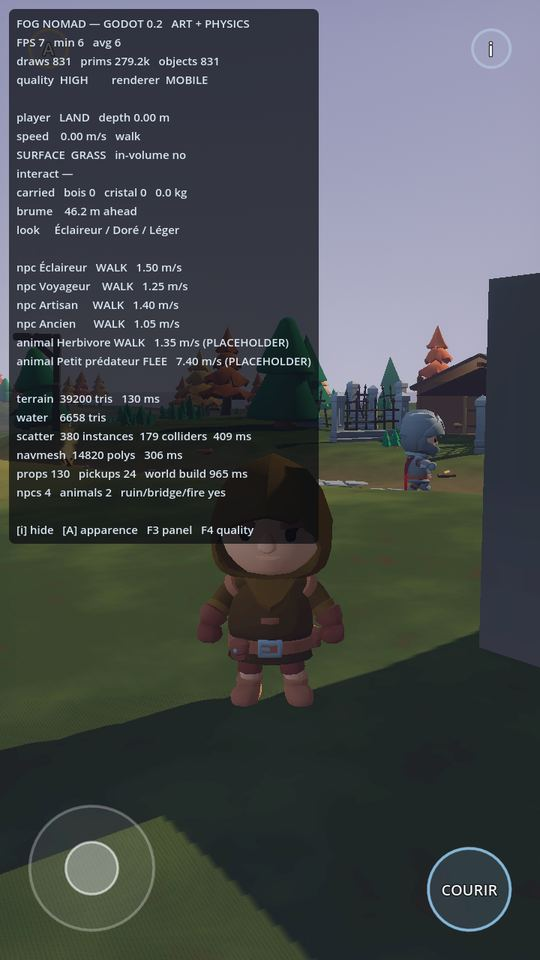
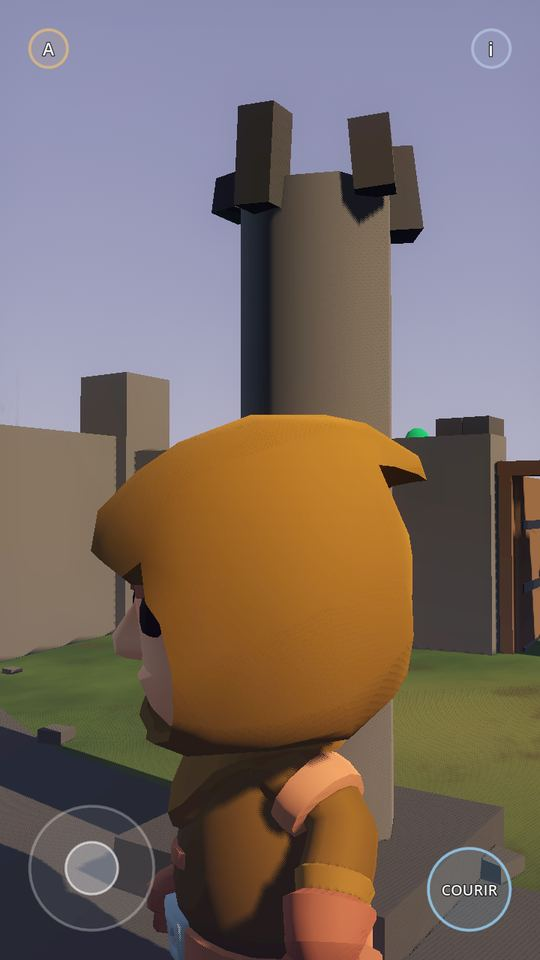

# NOMADSLAND™ — Godot 0.2.1
## Déplacement, collision et game feel

La 0.1 répondait à « Godot vaut-il le coup ». La 0.2 a rendu le monde
**matériel** : on ne traverse plus un arbre, un rocher, un mur, une ruine,
une tour, un pilier ni une porte fermée ; on ramasse en courant sans
ralentir ; on sait sur quoi on marche.

La **0.2.1** s'occupe d'une seule chose : **s'y déplacer doit commencer à
être agréable.** Trois paliers analogiques à 3.4 / 5.5 / 7.5 m/s au lieu de
1.5 / 4.8 ; un vrai saut, avec coyote time, tampon d'entrée et hauteur
variable ; les petits obstacles se franchissent au pas ; et les endroits où
l'on était bloqué sans voir d'obstacle ont été trouvés un par un, en
envoyant le personnage dedans.

Ce dépôt est **séparé** de Fog Nomad 0.7.2 (three.js), qui reste la
référence de gameplay et n'est modifié en aucune façon.

> 🏃 **Rapport 0.2.1 — déplacement, collisions, saut : [`docs/GODOT_0.2.1_MOVEMENT_BUGFIX.md`](docs/GODOT_0.2.1_MOVEMENT_BUGFIX.md)**
> 📄 **Rapport 0.2, verdicts et auto-audit : [`docs/RAPPORT_0.2.md`](docs/RAPPORT_0.2.md)**
> 🧱 **Vue d'ensemble 0.2 : [`docs/FOG_NOMAD_GODOT_0.2.md`](docs/FOG_NOMAD_GODOT_0.2.md)**
> ⚠️ **Assets bloqués et à télécharger : [`docs/ASSETS_TO_DOWNLOAD.md`](docs/ASSETS_TO_DOWNLOAD.md)**
> 📱 **Ouvrir sur téléphone : [`docs/ANDROID_PHONE_WORKFLOW.md`](docs/ANDROID_PHONE_WORKFLOW.md)**
> ⚖️ **Manifeste des assets : [`docs/ASSET_MANIFEST.md`](docs/ASSET_MANIFEST.md)** · **Physique : [`docs/PHYSICS_CONVENTIONS.md`](docs/PHYSICS_CONVENTIONS.md)** · **Interaction : [`docs/INTERACTION_SYSTEM.md`](docs/INTERACTION_SYSTEM.md)**
>
> 📄 Rapport 0.1 (archive) : [`docs/BENCHMARK_REPORT.md`](docs/BENCHMARK_REPORT.md)

| | |
| --- | --- |
|  |  |

---

## Contraintes tenues

| | |
| --- | --- |
| Moteur | **Godot 4.3**, renderer **Mobile** (jamais Forward+) |
| Langage | **GDScript uniquement** — pas de C#, pas de GDExtension, pas de plugin |
| Orientation | **Portrait**, fenêtre de référence 720 × 1280 |
| Scène | **une seule**, 280 × 280 m, `scenes/BenchmarkWorld.tscn` |
| Dépendances externes | **aucune** |
| Cible de test | Samsung Galaxy A55, éditeur Godot pour Android |

Pas de monde procédural, pas de chunks, pas de prologue, pas d'inventaire,
pas de craft : ce benchmark compare la **qualité de production**, pas le
streaming.

## Lancer

Importez le projet dans Godot 4.3+ et appuyez sur **PLAY**. La scène
principale est déjà réglée.

En ligne de commande :

```bash
godot --path . --rendering-method mobile --resolution 720x1280
```

## Vérifier

Les suites pilotent la vraie scène à travers la vraie physique et mesurent
des nombres. Rien n'est validé en lisant un nœud : l'audit de collision ne
demande pas si un arbre a un `CollisionShape3D`, il lance le
`CharacterBody3D` dessus et demande au serveur physique, image par image, si
le corps s'est retrouvé **à l'intérieur** de la géométrie.

```bash
godot --headless --path . --script tools/benchmark_tests.gd       # 31 / 31
godot --headless --path . --script tests/collision_world_test.gd  # 144 / 144
godot --headless --path . --script tests/world_systems_test.gd    # 17 / 17
godot --headless --path . --script tests/soak_test.gd             # 3 / 3
godot --headless --path . --script tests/movement_test.gd         # 37 / 37
```

**232 vérifications, 0 échec.** 12 obstacles × 6 approches × 2 niveaux de
qualité pour les collisions, désormais **au sprint** ; portes ouvertes et
fermées franchies pour de vrai ; six types de surface ; ramassage à pleine
course ; évitement des PNJ et des animaux ; fuite devant la Brume ; cinq
reconstructions du monde sans fuite de nœuds. Et, depuis la 0.2.1 : cinq
secondes de stick tenu par palier, hauteur et apex du saut chronométrés,
coyote time et tampon d'entrée vérifiés des deux côtés de leur fenêtre,
chaque ouverture visible d'un bâtiment franchie pour de vrai, et le pont
traversé, sauté et franchi par-dessus la rambarde.

## Organisation

```
scenes/            BenchmarkWorld.tscn (scène principale)
  testing/           ArtPhysicsShowcase.tscn (scène de revue, §69)
  player/ world/ npc/ animals/ environment/ fog/ ui/
scripts/
  physics_layers.gd  LA convention de couches — tout s'y réfère
  terrain_data.gd    LA fonction de terrain
  player/            contrôleur, caméra, et player_movement_config.gd —
                     LE fichier des vitesses, accélérations et du saut
  locomotion_rig.gd  AnimationTree partagé joueur/PNJ
  data/              SurfaceType, ItemDefinition, WorldObjectDefinition
  interaction/       InteractableComponent, Interactor
  characters/        CharacterAppearance, catalogue, builder, évitement souple
  world/             terrain, eau, dispersion, composition forestière,
                     porte, ruine, pont, feu, pilier, cabane, tour
shaders/            terrain, eau, brume, cristal, volutes, recoloration
assets/
  characters/ environment/ materials/ data/items/
  quaternius/        vide — voir docs/ASSETS_TO_DOWNLOAD.md
docs/               rapports, conventions, manifeste, guide téléphone
tools/ tests/       suites de tests, calibrations, captures
```

Le terrain, l'eau, le maillage de navigation, la végétation, les deux
bâtiments et toute la Brume sont **construits par script au chargement**
(≈ 510 ms), à partir d'une seule fonction de hauteur. Ce n'est pas de la
génération procédurale de monde — pas de graine, pas de chunks, pas de
streaming — c'est une scène fixe écrite en formules plutôt qu'en quarante
mille sommets, pour qu'elle reste **ouvrable et modifiable sur un
téléphone**.

## Produire l'archive

```bash
tools/make_zip.sh
```

Produit `build/nomadsland-godot-0.2.1.zip`, sans `.godot/` ni cache,
importable directement par Godot.

## Licence

Code de ce dépôt : à la discrétion du projet Fog Nomad.
Assets : **CC0 1.0** (KayKit, par Kay Lousberg) — usage commercial autorisé,
licences livrées à côté des fichiers. Détail dans `docs/ASSET_LICENSES.md`.
