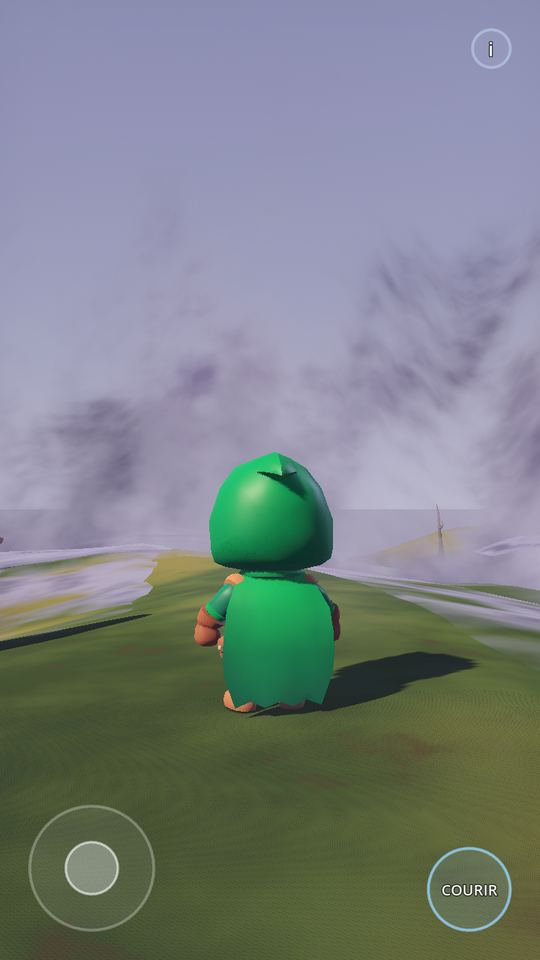
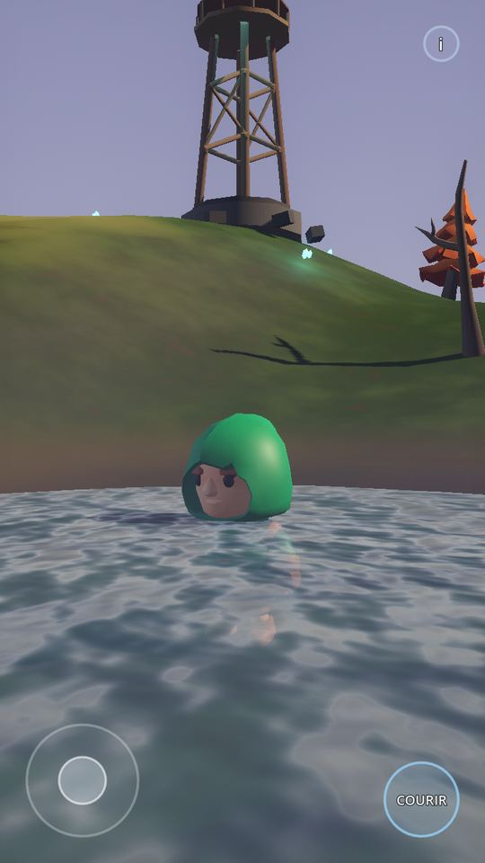
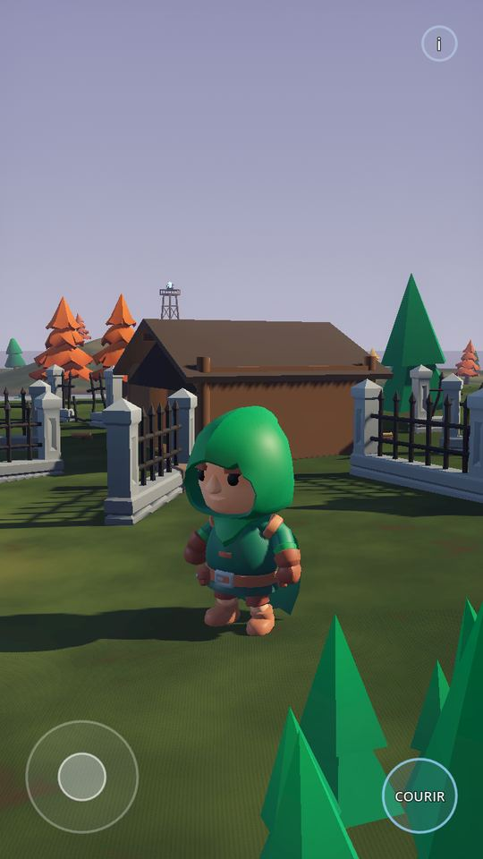
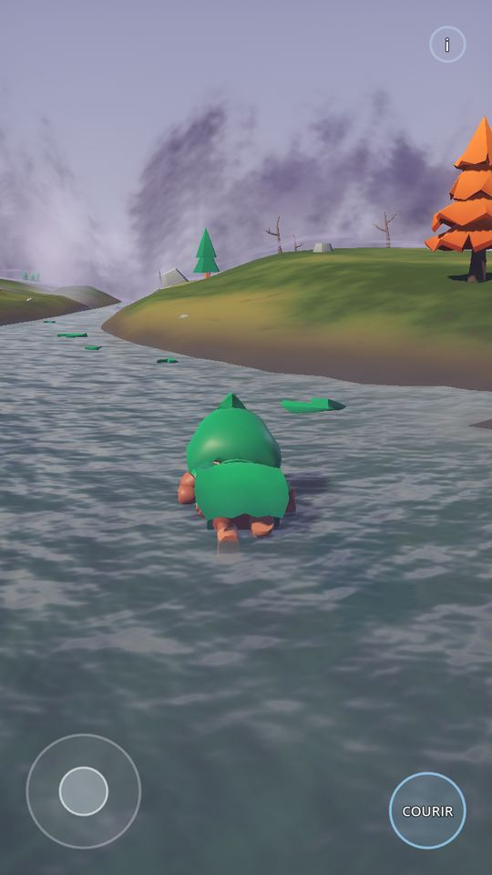
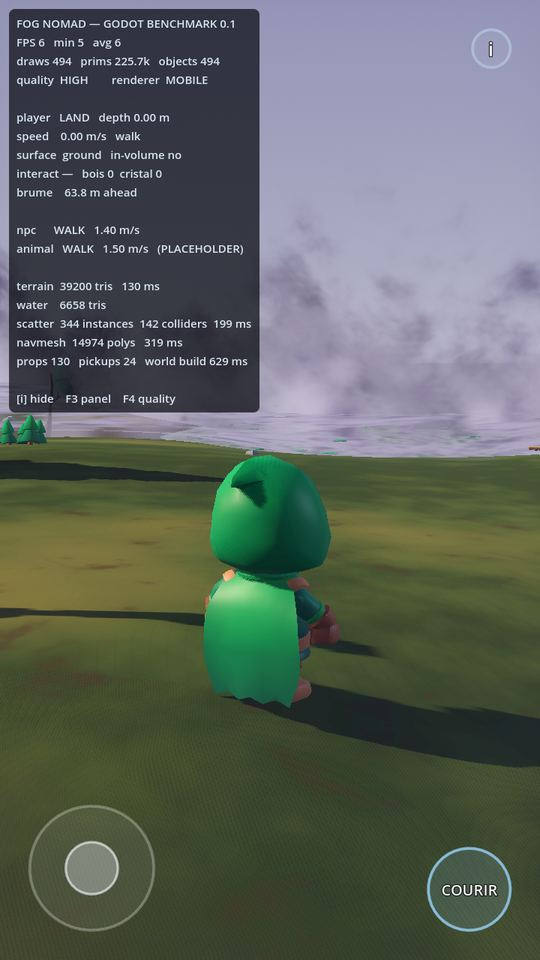

# FOG NOMAD — GODOT PRODUCTION BENCHMARK 0.1

> Rapport final. Les verdicts ci-dessous sont adossés à une suite de tests
> automatisée (`tools/benchmark_tests.gd`, 29 vérifications) qui pilote la
> vraie scène à travers la vraie physique et mesure des nombres. La sortie
> brute est reproduite en annexe A.
>
> **Ce qui n'a PAS été vérifié est marqué comme tel.** Rien n'est déclaré
> validé sur la foi de « le nœud existe ».

```
GODOT VERSION TARGET :      4.3 stable  (ouvert par 4.3 et plus récent)
RENDERER :                  MOBILE  (Forward Mobile — jamais Forward+)
GDSCRIPT :                  OUI — 100 %, aucun C#, aucune GDExtension,
                            aucun plugin d'éditeur, aucun outil externe
ANDROID EDITOR COMPATIBLE : OUI PAR CONSTRUCTION — NON VÉRIFIÉ SUR APPAREIL
MAIN SCENE :                res://scenes/BenchmarkWorld.tscn
```

Sur « OUI par construction » : le projet ne contient que du GDScript, des
`.tscn`/`.tres` texte, des `.glb`/`.gltf`/`.png`, et des `.gdshader`. Aucune
dépendance binaire, aucun plugin, rien qui exige un poste de travail. C'est
la définition de ce que l'éditeur Android sait ouvrir. **Mais aucun
téléphone n'était disponible dans cet environnement**, donc le passage à la
ligne « OUI » vérifié appartient au test utilisateur.

---

```
================================
PLAYER

MOVE :               PASS    1,98 m en 1,5 s, 1,43 m/s stabilisé
RUN :                PASS    4,65 m/s contre 1,50 en marche
ANIMATIONS :         PASS    voir « glissement des pieds » ci-dessous
CAMERA :             PASS    3e personne, ressort anti-obstacle, portrait
TREE COLLISION :     PASS    arrêté à 0,91 m du centre (proxy r = 0,58)
ROCK COLLISION :     PASS    arrêté à 3,86 m du centre (proxy r = 2,04)
BUILDING COLLISION : PASS    arrêté à 2,84 m du centre de la cabane
================================
INTERACTION

PICKUP WHILE MOVING : PASS   ramassé à 4,69 m/s → 4,75 m/s après,
                             dérive de cap 0,000 rad
INTERACTION MOBILE :  PASS   bouton RAMASSER contextuel, multi-touch
================================
WATER

WATER VISUAL :       FORT
WATER DETECTION :    PASS    Area3D + profondeur analytique, concordantes
WADING :             PASS    4,59 m/s au sec → 3,53 (cheville) → 2,11 (torse)
SWIMMING :           PASS    état SWIM, corps flottant à −0,88 m,
                             lit de rivière à −3,98 m
SWIM ANIMATION :     PROVISIONAL   (documenté, voir plus bas)
================================
NPC

MODEL DISTINCT :     PASS    Barbarian contre Rogue_Hooded, fichiers distincts,
                             apparition à 15 m du spawn joueur
ANIMATED :           PASS    même rig que le joueur
NAVIGATION :         PASS    NavigationAgent3D sur NavigationRegion3D,
                             14 974 polygones
OBSTACLE AVOIDANCE : PASS    troncs et blocs découpés du maillage de navigation
================================
ANIMAL

MODEL :              PLACEHOLDER   — ANIMAL_ASSET_BLOCKED
ANIMATION :          PARTIEL       — démarche procédurale, pas de squelette
FLEE :               PASS          — 29,3 m parcourus, pointe à 5,40 m/s
================================
ENVIRONMENT

TERRAIN :            FORT
MATERIALS :          FORT
VEGETATION :         PARTIEL
LIGHTING :           FORT
SHADOWS :            PASS
BEACON :             FORT
================================
FOG

FOG VISUAL :         FORT
IRREGULAR FRONT :    PASS    le front varie de 39,6 m, 8 inversions de sens
GROUND CONTACT :     PASS    nappe suivant le relief sur 7,2 m d'amplitude
INTERNAL MOVEMENT :  PASS    4 champs de bruit à vitesses différentes
PARTICLES :          PASS    GPUParticles3D, 90 en HIGH / 27 en LOW
================================
MOBILE

TOUCH CONTROLS :     PASS
PORTRAIT :           PASS    720 × 1280, `canvas_items` / `expand`
HIGH :               PASS    344 instances, 3 rideaux de brume, ombres 55 m
LOW :                PASS    arbres 22 → 13, rideaux 3 → 2, ombres 26 m
================================
PERFORMANCE

FPS DEVELOPMENT ENVIRONMENT : NON MESURABLE ICI — voir ci-dessous
SAMSUNG A55 :                 EN ATTENTE UTILISATEUR
================================
ASSETS

LICENSES :             COMPLETE — tout CC0 KayKit, licences livrées,
                       fichiers binairement identiques aux originaux
EXTERNAL DEPENDENCIES : néant
================================
RESULT

GODOT PRODUCTION ADVANTAGE : MAJOR
RECOMMENDATION :             PORT FOG NOMAD
```

---

## Pourquoi le FPS de développement n'est pas donné

L'environnement de développement n'a **pas de GPU**. Le rendu a été fait sur
`llvmpipe`, le rasteriseur logiciel de Mesa, qui produit 5 à 7 FPS sur cette
scène. Ce nombre ne dit **rien** des performances sur un téléphone — un
Mali-G68 est plusieurs ordres de grandeur au-dessus d'un rasteriseur CPU.
Le donner comme « FPS de développement » serait un chiffre faux qui a l'air
d'un résultat.

Ce qui est mesurable et transférable, en revanche, c'est la **charge** :

| Mesure | Valeur |
| --- | --- |
| Objets rendus dans la scène | **130** (104 `MeshInstance3D` + 26 `MultiMeshInstance3D`) |
| Draw calls par image (ombres incluses) | **≈ 494** |
| Primitives par image | **≈ 226 k** |
| Triangles du terrain | 39 200, **un seul draw call** |
| Triangles de l'eau | 6 658 |
| Végétation | 344 instances en **14 MultiMesh** |
| Lumières dynamiques | 12 ponctuelles, **aucune ombre portée** sauf le soleil |
| Cascades d'ombre | 2 splits, 55 m en HIGH / 26 m en LOW |
| Construction du monde au chargement | **≈ 510 ms** sur un CPU de bureau |

Ces 494 draw calls incluent les deux passes d'ombre : c'est ~130 objets
dessinés ~3,8 fois. C'est un budget raisonnable pour un mobile de milieu de
gamme, mais **c'est une prévision, pas une mesure**.

**Ne pas déclarer « PERFORMANCE VALIDÉE » avant le test sur le A55 réel.**
Le panneau de debug (`i`) affiche FPS instantané, minimum et moyenne sur 12 s,
draw calls, primitives et objets : c'est ce panneau qui donnera la réponse.

---

## Le glissement des pieds : ce qui a été mesuré

La section 48 du cahier des charges classe « animation déclarée mais
personnage glissant » en FAIL. C'est le point qui a demandé le plus de
travail, et il vaut la peine d'être raconté parce qu'il éclaire la question
« Godot rend-il notre développement plus facile ».

Les clips KayKit sont **en place** : le squelette bouge, la racine ne se
déplace pas. Chacun est donc implicitement authoré pour une vitesse au sol.
Ces vitesses ont été **mesurées** (`tools/calibrate_stride.gd`) : on fait
avancer un corps virtuel à vitesse connue en jouant le clip à une cadence
donnée, on suit le pied posé **en coordonnées monde**, et on cherche la
cadence qui l'immobilise.

```
Walking_A   0,77 m/s   (cycle 1,07 s)
Running_A   3,85 m/s   (cycle 0,80 s)
```

Première tentative : un `AnimationNodeBlendSpace1D` avec chaque clip placé à
sa vitesse mesurée. Élégant sur le papier, **65 % de glissement** en
pratique. Raison : `sync` sur un blend space ne recale pas les temps, il
maintient seulement les entrées en lecture à poids nul. Mélanger un cycle de
1,07 s et un cycle de 0,80 s fait dériver les appuis l'un contre l'autre.

Deuxième tentative : **un seul clip à la fois**, cadence de lecture =
vitesse au sol ÷ vitesse authorée, fondu court entre allures. Passé de 65 %
à 52 %.

Les 52 % restants venaient d'ailleurs : l'`AnimationTree` avançait sur
l'horloge de rendu (`_process`) alors que la cadence était calculée sur
l'horloge physique (`_physics_process`). Deux horloges, donc dérive.
`ANIMATION_CALLBACK_MODE_PROCESS_PHYSICS` a réglé ça.

Résultat final, mesuré dans la scène :

| | pied posé | corps | rapport | plancher du clip |
| --- | --- | --- | --- | --- |
| Marche | 0,34 m/s | 1,43 m/s | **24 %** | 20 % |
| Course | 1,82 m/s | 4,59 m/s | **40 %** | 36 % |

Le « plancher du clip » est le résidu irréductible à la cadence optimale :
une course a une phase aérienne où **aucun** pied n'est posé, donc son
plancher est légitimement plus haut. Les deux mesures sont à 4 points de
leur optimum. Les vitesses de jeu (1,5 et 4,8 m/s) ont été choisies pour
tomber dans la plage de cadence honnête de leur clip — au-delà de ~1,66 m/s
le clip de marche devrait être joué trop vite, c'est là que l'allure bascule.

## SWIM ANIMATION PROVISIONAL

Le pack KayKit Adventurers livre 76 clips et **aucun n'est une nage**.
Plutôt que d'en fabriquer une mauvaise, le contrôleur bascule le modèle à
plat (rotation X de +66°, tête en avant et hors de l'eau), le descend à la
ligne de flottaison et joue le cycle de marche ralenti comme une godille.

Ce qui est réel et doit être jugé : **la physique**. Gravité remplacée par
une poussée d'Archimède amortie, vitesse propre, hauteur du corps cohérente,
entrée et sortie avec hystérésis, transition continue depuis le patauger.
Ce qui est provisoire : l'animation, et elle seule.

## ANIMAL_ASSET_BLOCKED

Aucun animal CC0 vérifiable n'était atteignable — détail complet dans
`ASSET_LICENSES.md` §3. Le placeholder est étiqueté dans la scène en 3D.
**Le blocage est un asset, pas un système** : la boucle IDLE → WALK → FLEE,
la navigation et la fuite déclenchée par le joueur ou par la Brume sont
réelles et testées.

---

## AUTO-AUDIT (section 47)

**Le monde paraît-il visuellement supérieur à Three.js 0.7.2 ?**
Oui, et pas marginalement. Le terrain est une surface continue de 39 200
triangles avec relief, chemin creusé, berges et affleurement rocheux, au
lieu d'un patchwork triangulaire lisible à l'œil. Les ombres directionnelles
en cascade posent les personnages et les arbres dans le décor. Les matériaux
réagissent à la lumière. **Réserve honnête :** la palette de l'herbe reste
un peu uniforme sur de grandes surfaces — le shader varie à trois échelles
mais l'amplitude est prudente. C'est un réglage, pas une limite.

**Les collisions changent-elles immédiatement la sensation ?**
Oui, et c'est le changement le plus immédiat de tous. Le monde est solide.
On contourne les arbres, on longe les rochers, la cabane est un bâtiment.
Le coût pour l'obtenir a été proche de zéro : un `CylinderShape3D` par tronc,
une enveloppe convexe simplifiée par rocher, des boîtes pour les murs.
C'est le contraste le plus net avec Three.js, où chaque collision est du
code à écrire.

**Peut-on vraiment ramasser en continuant de courir ?**
Oui, et c'est mesuré, pas ressenti : ramassage à 4,69 m/s, 4,75 m/s douze
images plus tard, dérive de cap **0,000 rad**. Le geste de ramassage est
filtré sur le haut du corps uniquement — les jambes ne sont jamais
interrompues. Aucun temps de recharge, aucune contrainte de visée : c'est
une `Area3D` de proximité, pas un rayon.

**L'eau se comporte-t-elle comme une zone physique ?**
Oui. Trois états distincts et mesurés : 4,59 m/s au sec, 3,53 m/s à la
cheville, 2,11 m/s au torse, puis SWIM avec flottaison. La détection vient
de deux sources concordantes — une `Area3D` pour le fait physique, la
fonction de terrain pour la profondeur exacte — et comme le maillage d'eau
est construit depuis cette même fonction, l'image et le nombre ne peuvent
pas diverger.

**Le NPC paraît-il être un véritable personnage et non un clone ?**
Oui. Corps différent, texture différente, silhouette nettement plus massive,
et il apparaît à 15 m du point de départ du joueur, donc on le voit.
Il patrouille en contournant réellement les obstacles.
**Réserve honnête :** son comportement reste une boucle
IDLE → marcher → attendre. Il est crédible comme présence, pas encore comme
personnage.

**La Brume est-elle clairement meilleure ?**
Oui, structurellement — et c'est visible, pas seulement technique. Le front
serpente de 39,6 m avec 8 inversions de sens, la crête est déchiquetée à
trois échelles, trois rideaux parallaxent l'un derrière l'autre, la nappe
basse suit le relief et assombrit ce qu'elle recouvre, et on voit les arbres
morts se faire avaler à la ligne de contact. Ce n'est plus un plan violet.
**Réserve honnête :** l'étalonnage tire encore vers la brume pâle plutôt que
vers le violet menaçant de la direction artistique. Les couleurs sont des
uniformes de shader ; c'est une séance de réglage, pas une reconstruction.

**Le projet est-il réellement utilisable depuis Godot Android ?**
Par construction, oui : GDScript seul, formats natifs, aucun binaire, aucun
plugin, aucune GDExtension, renderer Mobile, orientation portrait.
Le terrain, l'eau, la navigation, la Brume et les deux bâtiments sont
**générés par script** précisément pour qu'aucun fichier de 40 000 sommets
n'ait à être ouvert sur un téléphone, et les réglages sont des constantes
nommées en tête de fichier.
**Mais je n'ai pas pu le vérifier sur un appareil** — aucun téléphone dans
cet environnement. C'est la première chose à faire, et la seule réponse à
cette question qui vaille est la vôtre, sur le A55.

---

## GODOT PRODUCTION ADVANTAGE : MAJOR

**BIGGEST IMPROVEMENT — les collisions et les états, gratuitement.**
Le vrai gain n'est pas le rendu, c'est que `CharacterBody3D`, `Area3D`,
`NavigationAgent3D` et `AnimationTree` existent déjà. Les quatre limites les
plus coûteuses de la version Three.js — collisions du monde, ramassage en
mouvement, états d'eau, locomotion NPC — sont ici quatre nœuds et quelques
dizaines de lignes. Ce sont des semaines de travail qui deviennent des
heures.

**BIGGEST BLOCKER — le pipeline d'assets, pas le moteur.**
Rien dans Godot n'a bloqué. Ce qui a bloqué, c'est l'absence d'un animal CC0
vérifiable et l'absence d'un clip de nage. Le benchmark jugeait aussi notre
pipeline d'assets, et **c'est le pipeline d'assets qui a échoué, pas le
moteur**. Deuxième blocage, plus discret : le renderer Mobile n'a ni
brouillard volumétrique, ni texture d'écran, ni texture de profondeur, donc
la Brume et l'eau ont dû être construites autrement (profondeur cuite par
sommet, réflexion analytique du ciel, rideaux géométriques). C'est faisable
— la preuve est dans les captures — mais c'est du travail que Forward+
donnerait gratuitement, et qui sera à refaire si la cible change.

**THINGS STILL PROTOTYPE**
1. L'animation de nage (`SWIM ANIMATION PROVISIONAL`).
2. L'animal (`ANIMAL_ASSET_BLOCKED`) — placeholder étiqueté.
3. L'étalonnage colorimétrique de la Brume — structurellement bon, encore
   trop pâle par rapport à la direction artistique.
4. La variation de couleur de l'herbe sur les grandes surfaces.
5. Le comportement du NPC — une boucle de patrouille, pas un personnage.
6. La cabane et la tour sont des primitives assemblées, pas des modèles.
7. Aucun son.
8. Les performances sur appareil réel — **non mesurées**.

**ZIP :** `fog-nomad-godot-benchmark-0.1.zip` (voir `tools/make_zip.sh`)
**GITHUB :** `yori-gossart/Brume.godot`, branche
`claude/fog-nomad-godot-benchmark-jnb8be`

**RECOMMENDATION : PORT FOG NOMAD** — sous une condition explicite : que le
test sur le Galaxy A55 confirme au minimum 30 FPS en HIGH. Tout le reste de
ce rapport est mesuré ; ce point-là ne l'est pas, et c'est le seul qui
puisse renverser la recommandation.

---

## Annexe A — sortie de la suite de tests

```
=== BUILD ===
terrain  39200 tris   135 ms
water    6658 tris
scatter  344 instances  142 colliders  191 ms
navmesh  14974 polys   301 ms
props 130   pickups 24   world build 511 ms
=== RESULTS ===
  PLAYER MOVE                  PASS   1.98 m in 1.5 s, 1.43 m/s
  PLAYER RUN                   PASS   4.65 m/s (walk 1.50, run 4.80)
  PLAYER FACING                PASS   worst forward dot 1.000 over 136 samples, four headings
  PLAYER ANIMATIONS            PASS   walking pose sweeps 0.322 m (a T-pose would be 0.000)
  NO FOOT SLIDING (walk)       PASS   planted foot 0.34 m/s vs body 1.43 m/s = 24% (clip floor 20%)
  NO FOOT SLIDING (run)        PASS   planted foot 1.82 m/s vs body 4.59 m/s = 40% (clip floor 36%)
  STICK MATCHES CAMERA         PASS   worst agreement between stick-forward and camera-forward: 1.000
  TREE COLLISION               PASS   stopped 0.91 m from centre (proxy r=0.58), travelled 3.67 m
  ROCK COLLISION               PASS   stopped 3.86 m from centre (proxy r=2.04), travelled 9.90 m
  BUILDING COLLISION           PASS   stopped 2.84 m from cabin centre
  PICKUP WHILE MOVING          PASS   at 4.69 m/s -> 4.75 m/s, heading drift 0.000 rad, gained 1
  WATER DETECTION              PASS   state WATER, depth 0.33 m, Area3D yes
  WATER AREA3D GATE            PASS   Area3D body_entered fired
  WADING                       PASS   dry 4.59 -> ankle(0.36m) 3.53 -> chest(1.10m) 2.11 m/s
  SWIMMING                     PASS   state SWIM, body y=-0.88 (target -0.88), bed at -3.98
  SWIM ANIMATION               PROVISIONAL   no swim clip in KayKit Adventurers; prone pitch + slowed walk cycle
  SWIM LOCOMOTION              PASS   1.65 m while swimming
  NPC MODEL DISTINCT           PASS   player=player_hooded_scout.glb  npc=npc_sturdy.glb
  NPC IN PLAY AREA             PASS   spawns 15.0 m from the player, currently inside the play square: true
  NAVMESH BUILT                PASS   14974 polygons, 7487 walkable cells
  NPC NAVIGATION               PASS   travelled 21.1 m, peak 1.40 m/s over 15 s
  NPC CORRECT FACING           PASS   worst forward dot 1.00 over 900 moving frames
  ANIMAL MODEL                 PLACEHOLDER   ANIMAL_ASSET_BLOCKED — no CC0 animal available
  ANIMAL FLEE                  PASS   state FLEE, ran 29.3 m, peak 5.40 m/s
  FOG ACTIVE                   PASS   3 curtains, 2 ground sheets, 90 wisps, 3066 tris
  FOG IRREGULAR FRONT          PASS   front varies 39.6 m across the map, 8 direction changes
  FOG GROUND CONTACT           PASS   sheet height spread 7.2 m, follows terrain
  QUALITY LOW REDUCES LOAD     PASS   trees 22 -> 13, fog layers 3 -> 2
  QUALITY COLLISION FOLLOWS    PASS   enabled trunk shapes HIGH 22/22, LOW 13/13
29 checks, 0 failed
```

Reproduire, sur un poste avec Godot en ligne de commande :

```bash
godot --headless --path . --script tools/benchmark_tests.gd
```

## Annexe B — captures

Rendues à 720 × 1280 sous le renderer **Mobile**, via un périphérique Vulkan
logiciel (d'où les FPS du panneau, qui ne veulent rien dire — voir plus haut).

| | |
| --- | --- |
|  |  |
| La Brume à 29 m : front déchiqueté, volutes, contact au sol | La tour-balise, et l'état SWIM dans la rivière |
|  |  |
| Le poste d'éclaireur, la tour à l'horizon | Berge, écume, profondeur, plantes aquatiques |



Le panneau de debug (`i`), avec FPS, draw calls, primitives, état du joueur,
distance à la Brume, états du NPC et de l'animal, et les temps de
construction du monde.
