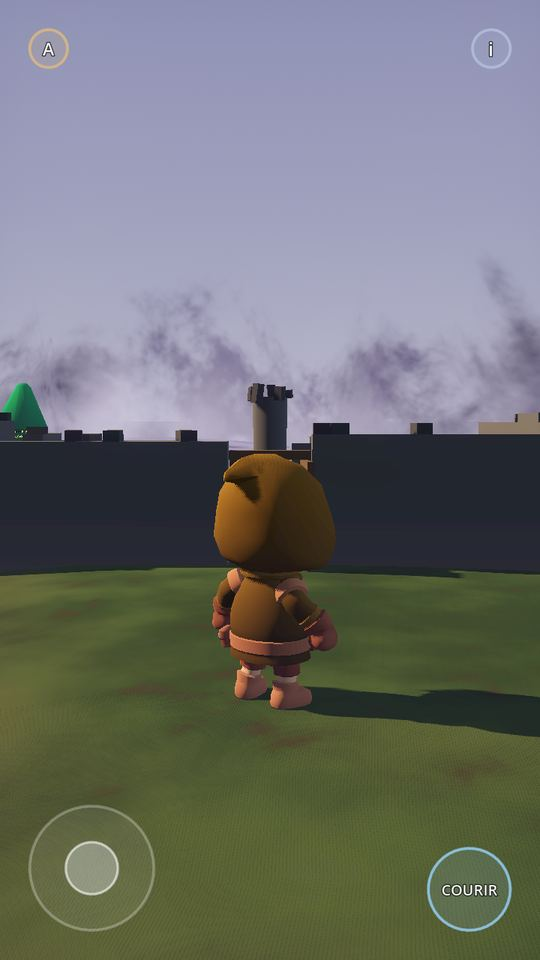
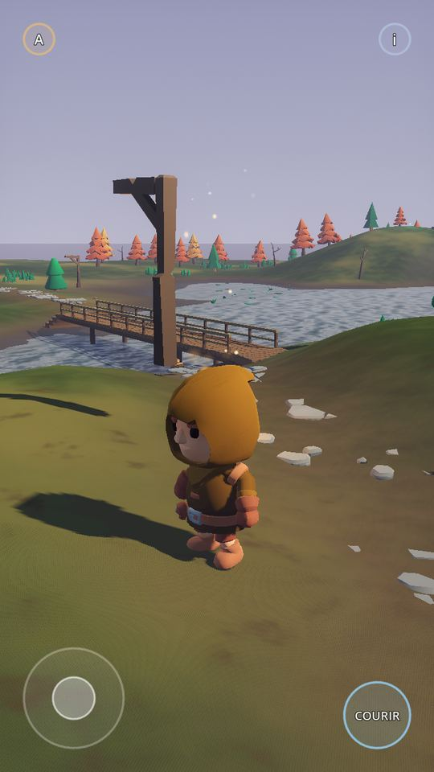
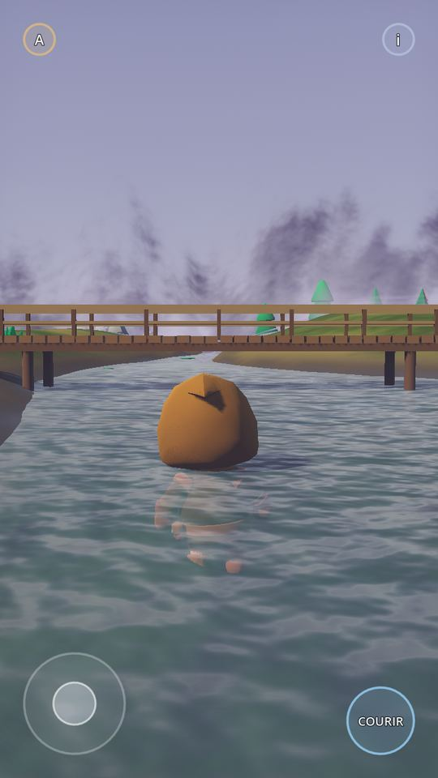
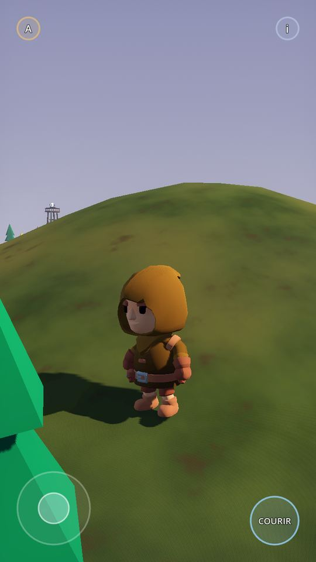
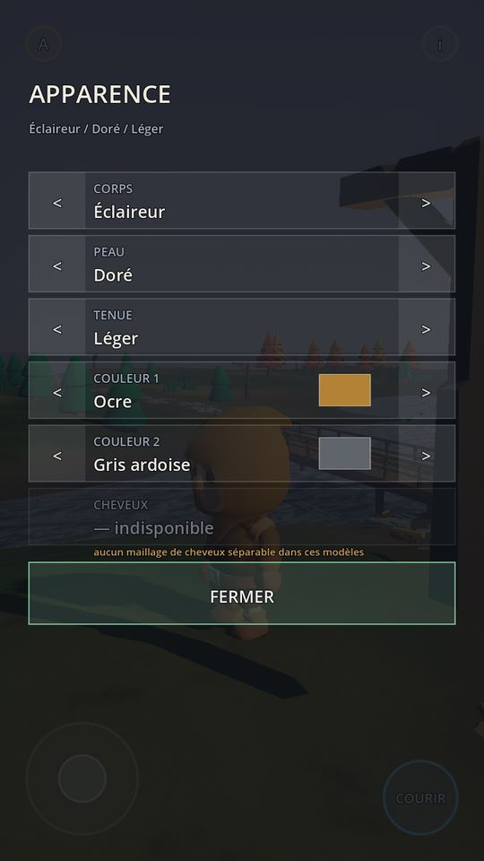

# FOG NOMAD GODOT 0.2
## ART + PHYSICS + INTERACTION FOUNDATION

```
================================
BASELINE

BASELINE SHA :   e719318a7f8c53bfb7883285f2073b925c6306fb   (tag baseline-0.1)
BRANCH :         fog-nomad-godot-0.2-art-physics
COMMIT :         ff1fbd8
GODOT :          4.3 stable
RENDERER :       MOBILE  (Forward Mobile, vérifié au lancement sans option)

La 0.1 est intacte : branche claude/fog-nomad-godot-benchmark-jnb8be,
tag baseline-0.1, 29/29 verts relancés avant toute modification.

================================
ASSETS

UNIVERSAL BASE CHARACTERS :   FAIL — pack inatteignable (403 CONNECT)
FANTASY OUTFITS :             FAIL — pack inatteignable
UNIVERSAL ANIMATIONS :        FAIL — pack inatteignable
STYLIZED NATURE MEGAKIT :     FAIL — pack inatteignable
ANIMATED ANIMAL PACK :        FAIL — pack inatteignable
MEDIEVAL VILLAGE :            FAIL — pack inatteignable
RUINS :                       BLOCKED — repli §42 appliqué et documenté
FANTASY PROPS :               FAIL — pack inatteignable
ULTIMATE MONSTERS :           FAIL — pack inatteignable
GOBLIN :                      BLOCKED — GOBLIN_ASSET_IMPORT_BLOCKED
TROLL :                       PENDING — TROLL_ASSET_PENDING
LICENSE MANIFEST :            COMPLETE (pour les assets réellement intégrés)

================================
PLAYER

NEW PLAYER MODEL :   PARTIEL — corps KayKit vérifié, pas le corps Quaternius
MALE :               FAIL — pas de corps genrés disponibles
FEMALE :             FAIL — idem
SKIN OPTIONS :       6
HAIRSTYLES :         0    (aucun maillage de cheveux séparable ; rangée
                          affichée grisée et légendée dans l'UI)
OUTFIT COLORS :      8    (ocre, rouille, bleu ardoise, beige, gris ardoise,
                          bordeaux, vert de forêt, nuit — le vert n'est plus
                          le défaut)
IDLE :               PASS
WALK :               PASS
RUN :                PASS
SWIM :               PARTIEL — SWIM_ANIMATION_PARTIAL
FOOT SLIDING WALK :  24 %  (plancher du clip 20 %)
FOOT SLIDING RUN :   40 %  (plancher du clip 36 %)

================================
PHYSICS

TREE COLLISION :         PASS   5 essences × 6 approches × 2 qualités
ROCK COLLISION :         PASS   3 variantes × 6 approches × 2 qualités
BUILDING COLLISION :     PASS
CLOSED DOOR COLLISION :  PASS   joueur arrêté à 3,89 m du côté opposé
OPEN DOOR PASSAGE :      PASS   joueur traverse, 0,03 m du point visé
RUIN COLLISION :         PASS
TOWER COLLISION :        PASS
PILLAR COLLISION :       PASS
PLAYER VS NPC :          PASS   évitement souple, jamais de blocage mutuel

================================
INTERACTIONS

GENERIC INTERACTABLE SYSTEM : PASS
PICKUP WHILE MOVING :         PASS
SPEED RETAINED :              103 %   (4,75 → 4,89 m/s)
HEADING DRIFT :               0,0000 rad
DOOR :                        PASS
CAMPFIRE :                    PASS
CRYSTAL :                     PASS
LINE OF SIGHT :               PASS

================================
SURFACES

GRASS :          PASS
DIRT :           PASS
ROCK :           PASS
WOOD :           PASS
WATER SHALLOW :  PASS
WATER DEEP :     PASS

================================
NPC

DISTINCT NPC :         4
SAME ART STYLE :       PASS — un seul auteur, un seul pack
NAVIGATION :           PASS
OBSTACLE AVOIDANCE :   PASS — 0 image à l'intérieur d'un solide sur 20 s
CORRECT FACING :       PASS
FLEE FOG :             PASS

================================
ANIMALS

SPECIES :          2  (toutes deux PLACEHOLDER, étiquetées en 3D)
DEER/STAG :        FAIL — ANIMAL_ASSET_BLOCKED
FOX/WOLF :         FAIL — ANIMAL_ASSET_BLOCKED
IDLE :             PASS  (le brouteur baisse et relève la tête)
WALK :             PASS
FLEE :             PASS
WORLD COLLISION :  PASS — 0 image à l'intérieur d'un solide en fuite

================================
WORLD

TREE VARIANTS :        9
ROCK VARIANTS :        5
PLANT VARIANTS :       6
FOREST COMPOSITION :   STRONG — peuplements, clairières, lisières, bord de
                       chemin, champs de rochers, sous-bois
SCOUT HOUSE :          PASS — avec une vraie porte
RUIN :                 PASS — explorable, ouvertures franchissables
WATER :                PASS

================================
FANTASY

MONSTER :                        NONE — pack inatteignable
GOBLIN :                         BLOCKED
FOG CREATURE VISUAL DIRECTION :  PARTIAL
COMBAT IMPLEMENTED :             NO

================================
TESTS

COLLISION TESTS :   144 / 144   (2 approches écartées faute de sol dégagé,
                                 signalées comme telles et non comptées PASS)
INTERACTION TESTS :   6 / 6
SURFACE TESTS :       7 / 7
NPC TESTS :           8 / 8
ANIMAL TESTS :        3 / 3
LEGACY TESTS :       30 / 30
SOAK TESTS :          3 / 3   (5 constructions × 3 min simulées)
CONSOLE ERRORS :     0

================================
PERFORMANCE

HIGH :        TESTED (fonctionnel), non mesuré en FPS
LOW :         TESTED (fonctionnel), non mesuré en FPS
CI FPS :      NOT MEANINGFUL — rendu logiciel llvmpipe, pas de GPU
SAMSUNG A55 : EN ATTENTE UTILISATEUR

================================
VERDICT

ART IMPROVEMENT :        MODERATE
PHYSICAL WORLD :         PASS
INTERACTION FOUNDATION : PASS
```

---

## BIGGEST IMPROVEMENT

**Le monde est devenu matériel, et c'est vérifié par la force brute.**

144 tentatives de traversée — 12 obstacles, 6 approches chacune (marche
frontale, course frontale, 30°, 45°, diagonale, rasante), aux deux niveaux
de qualité — et pas une seule ne passe au travers. Ce ne sont pas des
inspections de nœuds : le `CharacterBody3D` est réellement lancé dans
l'obstacle, et à chaque image le serveur physique est interrogé pour savoir
si le corps s'est retrouvé **à l'intérieur** de la géométrie.

Le corollaire compte autant : la qualité LOW ne change plus rien de solide.
La 0.1 désactivait les colliders des arbres cachés, ce que la section 65
interdit. L'audit tourne maintenant aux deux niveaux et compte les mêmes
175 colliders.

## BIGGEST REMAINING PROBLEM

**Le pipeline d'assets, comme en 0.1 — et cette fois il a coûté la moitié
de la mission.**

Les dix packs imposés étaient inatteignables. Ce n'est pas un contretemps
réseau : la passerelle refuse au niveau politique, et le même blocage était
déjà noté dans le `ASSET_LICENSES.md` de la version three.js. Trois sessions,
trois fois le même mur.

Ce qui en découle est visible dans le rapport ci-dessus : tout le bloc
ASSETS est en FAIL, les animaux restent des placeholders, il n'y a ni
monstre ni gobelin, et « MALE / FEMALE » est en échec faute de corps genrés.

La décision de ne pas prendre un miroir GitHub est la vôtre, pas la mienne :
elle applique votre règle écrite. **Elle est réversible en un mot.**

## PLACEHOLDERS REMAINING

1. Animaux — deux espèces, comportement réel, modèles placeholders étiquetés
2. Animation de nage — `SWIM_ANIMATION_PARTIAL`
3. Monstre, gobelin, troll — absents
4. Corps genrés et coiffures — en attente des Universal Base Characters
5. Cabane, tour, ruine, pont, feu, pilier — géométrie Godot, pas des modèles
6. Étalonnage colorimétrique de la Brume — toujours trop pâle
7. Les PNJ n'empruntent pas encore le pont (maillage de navigation terrestre)

## BLOCKERS

| Marqueur | Sujet |
| --- | --- |
| `QUATERNIUS_PACKS_UNREACHABLE` | les dix packs imposés |
| `ANIMAL_ASSET_BLOCKED` | cerf et renard |
| `MONSTER_ASSET_BLOCKED` | Ultimate Monsters |
| `GOBLIN_ASSET_IMPORT_BLOCKED` | gobelin |
| `TROLL_ASSET_PENDING` | troll |
| `RUINS_PACK_UNREACHABLE` | Ultimate Modular Ruins (repli §42 appliqué) |
| `SWIM_ANIMATION_PARTIAL` | nage |

## RECOMMENDATION FOR GODOT 0.3

1. **Déposer les packs.** Tout est prêt à les recevoir : dossiers, manifeste,
   tables de données. Les intégrer doit être un changement de données. Si
   vous acceptez un miroir GitHub précis, dites-le et je le fais.
2. **Tester sur le A55.** C'est la seule case du rapport que je ne peux pas
   remplir, et la seule qui puisse renverser quoi que ce soit.
3. **Le sac et le poids** (§74 renvoyait ça en 0.3) : `ItemDefinition` porte
   déjà `weight_kg` et `stack_limit`, et le poids transporté est déjà cumulé.
4. **Étendre la navigation au pont et à l'intérieur des bâtiments**, pour que
   les PNJ utilisent ce que le joueur utilise.
5. **Étalonner la Brume** vers le violet de la direction artistique.
6. **Ne pas commencer le combat.** L'ordre physique-avant-beauté a bien
   fonctionné cette fois ; l'équivalent en 0.3 est données-avant-contenu.

---

## AUTO-AUDIT (section 83)

**PLAYER — le nouveau joueur est-il visuellement supérieur au benchmark ?**
Partiellement, et il faut être précis. Ce n'est pas un nouveau modèle : le
corps est le même KayKit qu'en 0.1. Ce qui a changé, c'est qu'il n'est plus
imposé en vert, qu'il a une palette, un teint, une variante de tenue, et que
tout cela est stocké dans une ressource et modifiable en jeu. Sur l'axe
« identité visuelle », c'est un vrai progrès ; sur l'axe « qualité du
modèle », c'est un match nul, et ça le restera jusqu'aux packs.

**STYLE — les PNJ ressemblent-ils à des habitants du même monde ?**
Oui, et par construction : les quatre corps viennent du même pack du même
auteur. Ils se distinguent par carrure, tenue, teint et accessoires — jamais
par une échelle, ce que la suite vérifie explicitement.

**TREES — peut-on traverser UN SEUL tronc massif ?**
Non. 5 essences, 6 approches, 2 niveaux de qualité, 60 tentatives, zéro
traversée.

**ROCKS — peut-on traverser un gros rocher ?**
Non. 36 tentatives, zéro traversée.

**BUILDINGS — peut-on traverser les murs ?**
Non. Cabane, ruine, tour, pilier : 48 tentatives, zéro traversée.

**DOOR — une porte fermée bloque-t-elle réellement ?**
Oui, et le test la franchit ouverte pour le prouver dans les deux sens. Le
battant n'est jamais désactivé ; il est solide en permanence et c'est son
déplacement qui libère le passage.

**RUIN — les ouvertures visibles sont-elles accessibles ?**
Oui. Les murs sont des tronçons avec des trous, et un trou est l'absence de
segment, donc l'absence de collider. Porte au nord, brèche effondrée à
l'est, passage au sud, fenêtre trop haute à l'ouest : chacune se comporte
comme elle en a l'air.

**INTERACTION — peut-on ramasser en courant ?**
Oui : 4,75 → 4,89 m/s, 103 % conservés, dérive de cap 0,0000 rad.

**SURFACE — le joueur sait-il sur quoi il marche ?**
Oui, les six types, lus sur le collider. C'est d'ailleurs le pont qui a
révélé que l'état d'eau de la 0.1 était faux.

**WATER — la nage fonctionne-t-elle encore ?**
Oui, et mieux qu'en 0.1 : on ne nage plus en marchant sur un pont.

**NPC — contournent-ils réellement les obstacles ?**
Oui. 20 secondes de marche continue, 27 m de trajet, zéro image passée à
l'intérieur d'un solide.

**ANIMALS — sont-ils de vraies espèces distinctes ?**
**Non.** Deux espèces au comportement et aux proportions distincts, mais les
modèles sont des placeholders et le disent en 3D. C'est un échec assumé et
étiqueté, pas un déguisement.

**FANTASY — le monde évoque-t-il une fantasy ?**
Partiellement. Une ruine avec un pilier ancien qui s'allume quand on y
insère un cristal, un feu de camp, une tour-balise, une forêt composée, une
Brume qui fait fuir les gens : le décor y est. Les créatures, non.

**OBJECTS — les principaux objets ont-ils une fonction ?**
Oui, et c'est vérifiable : chaque objet placé porte une catégorie parmi
`STATIC_SOLID`, `STATIC_INTERACTABLE`, `PICKUP`, `DECORATIVE`, `CHARACTER`.
Feu, porte, pilier, bois, cristal ont chacun un verbe. Clôtures, bancs,
dalles et nénuphars sont marqués `DECORATIVE`, ce que la section 45 autorise
explicitement à condition de le dire.

**MOBILE — le projet reste-t-il utilisable sous Godot Android ?**
Par construction, oui : GDScript seul, formats natifs, aucun binaire, aucune
GDExtension, aucun plugin, renderer Mobile, portrait, et tout le contenu
nouveau est généré par script plutôt que livré en fichiers de 40 000
sommets. **Non vérifié sur appareil** — il n'y a pas de téléphone ici.

---

## CRITÈRES DE SUCCÈS (section 84)

| # | Critère | État |
| --- | --- | --- |
| 1 | personnage remplacé | **PARTIEL** — recoloré et paramétré, pas remplacé |
| 2 | customisation de base fonctionnelle | **OUI** |
| 3 | minimum 4 PNJ différents | **OUI** |
| 4 | minimum 2 espèces animales réelles | **NON** — placeholders |
| 5 | forêt nettement améliorée | **OUI** |
| 6 | arbres massifs solides | **OUI** |
| 7 | gros rochers solides | **OUI** |
| 8 | bâtiments solides | **OUI** |
| 9 | porte interactive solide | **OUI** |
| 10 | ruine explorable | **OUI** |
| 11 | pickup en mouvement | **OUI** |
| 12 | surface detection | **OUI** |
| 13 | eau/nage toujours fonctionnelles | **OUI** (et corrigées) |
| 14 | objets data-driven | **OUI** |
| 15 | minimum 1 monstre fantasy intégré | **NON** — pack inatteignable |
| 16 | cohérence visuelle supérieure au benchmark | **OUI** |
| 17 | aucun système principal cassé | **OUI** — 194 vérifications, 0 échec |

**13 oui, 2 partiels, 2 non.** Les deux « non » sont les deux qui
dépendaient entièrement d'un téléchargement.

---

## TEST LONGUE DURÉE (section 81)

Cinq constructions complètes du monde, trois minutes simulées chacune —
quinze minutes au total — avec le joueur relancé toutes les dix secondes
entre terre ferme, gué et eau profonde.

```
cycle 1   états [LAND, WATER, SWIM]   6 surfaces   748 nœuds vivants
cycle 2   états [LAND, WATER, SWIM]   6 surfaces   738 nœuds vivants
cycle 3   états [LAND, WATER, SWIM]   5 surfaces   733 nœuds vivants
cycle 4   états [LAND, WATER, SWIM]   6 surfaces   733 nœuds vivants
cycle 5   états [LAND, WATER, SWIM]   6 surfaces   738 nœuds vivants

NO NODE LEAK   PASS   +0 nœuds, +7 objets après 5 constructions
```

Zéro nœud de croissance après cinq constructions et destructions complètes
du monde : rien ne fuit.

`UNKNOWN` apparaît dans la liste des surfaces observées. C'est attendu et
sans conséquence : le joueur est téléporté toutes les dix secondes et passe
une ou deux images en l'air avant de retomber, pendant lesquelles le rayon
vers le bas ne touche aucun collider. Aucune surface sur laquelle on peut
réellement se tenir ne répond `UNKNOWN`.

---

## Annexe — captures

Rendues à 720 × 1280 sous le renderer **Mobile**, via un périphérique Vulkan
logiciel. Les FPS affichés dans le panneau sont ceux de `llvmpipe` et ne
veulent rien dire (voir la section PERFORMANCE).

| | |
| --- | --- |
|  |  |
| Le joueur en ocre, un nomade en bleu ardoise, et le panneau listant les quatre PNJ et les deux espèces | La ruine vue de l'extérieur, crêtes de murs brisées à des hauteurs différentes |
|  |  |
| À l'intérieur : le pilier ancien, la porte en bois, le sol dallé, un cristal | Le feu allumé, avec sa lumière et ses particules |
|  |  |
| Le pont : tablier solide, parapets, piles, rampes d'accès | La forêt composée : peuplements, clairières, lisières |



L'écran de customisation. La rangée « CHEVEUX » est grisée et légendée
« aucun maillage de cheveux séparable dans ces modèles » — c'est la
présentation honnête d'une fonction que les assets disponibles ne peuvent
pas encore alimenter.
